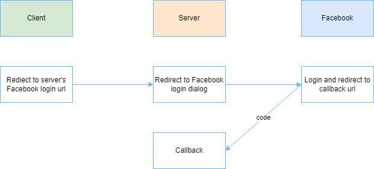
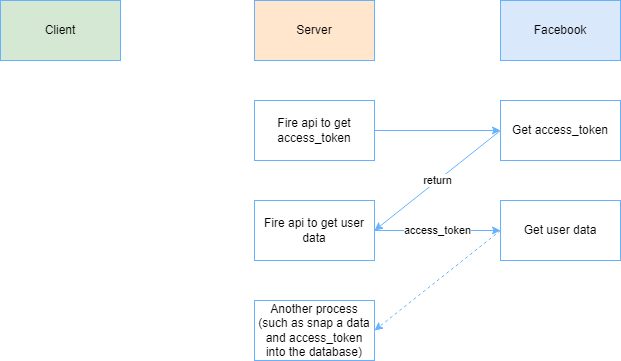

<h1>GO Facebook OAuth</h1>
<p>***This is unofficial package</p>
<p>This project is just to build a package to do the OAuth with Facebook from my pain to write a code by hand.</p>

<h2>Authorization Request</h2>


<h2>Callback</h2>


<h2>Services List</h2>
<p>For permission or fields you can see in official docs <a href="https://developers.facebook.com/docs/graph-api/reference/user/">https://developers.facebook.com/docs/graph-api/reference/user/</a></p>

```go
GetCallbackUrl(state string, permissions ...UserPermission) (string, error)
GetAccessToken(code string) (*models.UserAccessToken, error)
GetUserData(userAccessToken string, fields ...UserFields) (*models.UserProfile, error)
Logout(userAccessToken string) (*models.UserLogoutRes, error)
```

<h2>Quickstart</h2>
<p>This code below is to redirect, callback, and get user's data.</p>

<p>***You can use Ngrok to put localhost on the internet for test.</p>

```go
package main

import (
	"encoding/json"
	"fmt"
	"net/http"

	"github.com/Rayato159/go-facebook-oauth/src"
)

func main() {
	oauth := src.NewGoFacebookOauth(
		"15.0",
		"callback-url",
		"app-id",
		"client-secret",
	)

	http.HandleFunc("/login", func(w http.ResponseWriter, r *http.Request) {
		url, err := oauth.GetCallbackUrl("test")

		w.Header().Set("Content-Type", "application/json")
		if err != nil {
			json.NewEncoder(w).Encode(map[string]string{
				"message": err.Error(),
			})
		}
		http.Redirect(w, r, url, http.StatusFound)
	})

	http.HandleFunc("/callback", func(w http.ResponseWriter, r *http.Request) {
		query := r.URL.Query()
		code := query.Get("code")

		token, err := oauth.GetAccessToken(code)
		if err != nil {
			json.NewEncoder(w).Encode(map[string]string{
				"message": err.Error(),
			})
		}
		fmt.Println(token)

		profile, err := oauth.GetUserData(token.AccessToken)
		if err != nil {
			json.NewEncoder(w).Encode(map[string]string{
				"message": err.Error(),
			})
		}
		json.NewEncoder(w).Encode(profile)
	})

	http.HandleFunc("/logout", func(w http.ResponseWriter, r *http.Request) {
		res, err := oauth.Logout("access_token")
		if err != nil {
			json.NewEncoder(w).Encode(map[string]string{
				"message": err.Error(),
			})
		}
		json.NewEncoder(w).Encode(res)
	})

	fmt.Println("Listening on port 3000...")
	err := http.ListenAndServe(":3000", nil)
	if err != nil {
		panic(err)
	}
}
```

<h2>Usage</h2>
<ol>
	<li>Create the Facebook Login app</li>
	<li>Setup the Ngrok url to put localhost to internet</li>
	<li>Setup the callback url (http://your-server-host/callback) on your Facebook Login app</li>
	<li>Redirect to http://your-server-host/login</li>
	<li>Authorize the Facebook app</li>
	<li>Success!</li>
</ol>